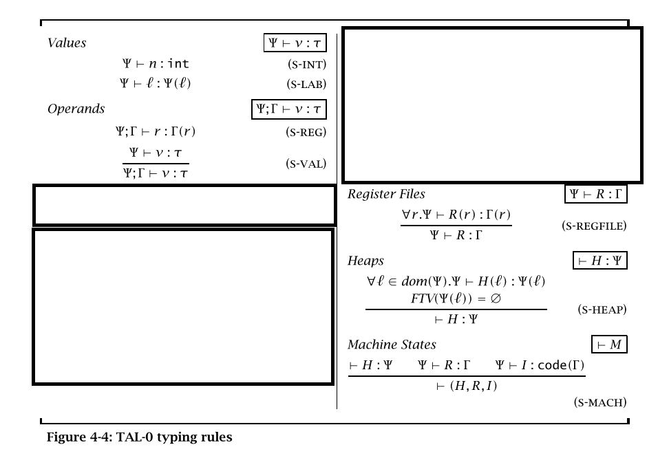

Code: [https://github.com/rctcwyvrn/tal-inference](https://www.youtube.com/watch?v=dQw4w9WgXcQ)

Run dockerfile: `run.sh`

# Motivations 

In the TAL paper we saw that typed assembly was able to provide a number of useful safety properties for assembly, like not getting stuck and not accessing unallocated memory. However we also saw that TAL requires a set of label types, either generated by a compiler or handwritten by the programmer. Since there are many existing assembly programs that lack these annotations, as well as compilers that aren't designed to output types in the back-end, an interesting idea would be to implement a type inference system for TAL.

This project attempts to do exactly that, inferring all types for TAL with jumps and pointers. The goals are to prevent the same classes of issues that the original TAL and the ATAPL TAL attempted to avoid, namely getting stuck and accessing unbound memory.

# Syntax

The instructions are

- `add r1 r2 v`, `sub r1 r2 v`
- `mov r1 r2`
- `bnz r2 v`
- `load r1 r2 i`
- `store r1 i r2`
- `store-strong r1 i r2`
- `malloc r1 n`
- `commit r1`

which all follow the same runtime semantics as what we saw in ATAPL. 

# Typing rules

## Basic types
Our basic types are 

- $int$

- $Top$

- $UniqPtr(\{ l_i: \tau_i\}, \rho)$

- $Ptr(\{ l_i: \tau_i\}, \rho)$

- $Code(\{ r_i: \tau_i\})$

Let $R$ be the set of registers and let $\Gamma[r_i]$ refer to $\tau_i$ for $\Gamma = \{r_i: \tau_i\}$

## Heap, registers, values

As expected, the typing rules implemented mirror the structure of TAL but with constraint generation. First we follow identical rules for well typing of a value, operand, heap and register as seen in ATAPL Figure 4-4 (page 148).

## Instruction sequences

We have slightly different rules for instruction sequences. Firstly, an instruction sequence now generates a set of constraints

$$
\frac{\Psi;\Gamma\vdash i: (\Gamma, C) \rightarrow (\Gamma_2, C') \quad \Psi;\Gamma_2 \vdash I: (\Gamma_2, C') \rightarrow (\Gamma_3, C'')}
{ \Psi;\Gamma \vdash i;I: (\Gamma, C) \rightarrow (\Gamma_3, C'')} (\text{SeqC})
$$

The interpretation of this rule is that an instruction sequence $i;I$ maps a pair of initial register state and preconditions, to a pair of register state after execution and additional constraints that must hold for valid computation. What this rule is doing is threading the state and constraint accumulators accordingly.

An instruction sequence is then well typed if we can type and satisfy all constraints with variables as the initial state

$$
\frac{\Gamma_1 = \{r: X_r | r\in R\} \quad X_r \in FTV(\Psi) \quad \Psi;\Gamma_1\vdash I: (\Gamma_1, \emptyset) \rightarrow (\Gamma, C)}
{ \Psi\vdash I: Code(L(S(\Gamma_1)))} (\text{SeqTy})
$$

where $S$ is the mapping generated from solving $C$ and $L$ is a substitution from $X_r \rightarrow Top$.

## Jumps
The last piece of the puzzle is how to typecheck a `jump` terminal. As mentioned during the presentation, jumps include subtyping as well as a bunch of _very_ questionable checks to avoid creating recursive types while still constraining labels properly. I don't know how to write it out formally so here's an approximation

When typechecking a `bnz v`/`jump v`

- $\Psi, \Gamma \vdash v \Leftarrow T$

- Let $T' = Code(\{r: T_r | r\in R\})$ where $T_r$ is a fresh type variable

- If $T$ is a variable corresponding to a parameter for this label, then for each register $r\in R$, add constraint $\Gamma[r] = T_r$ to $C'$ if $\Gamma[r]$ is an $int$, $Ptr$, or $UniqPtr$.

- Add the constraint $\Gamma <: \{r: T_r | r\in R\}$ to $C'$

- The `bnz`/`jump` then has type $(\Gamma, C) \rightarrow (\Gamma, C')$

## Subtyping
Since the system implemented mirrors the original TAL, we also have a subtyping rule for contexts and pointers, however note that there is no generic subsumption rule. Subtyping is only allowed in jumps as seen in the above rule. We only require weakening since pointer indicies are inherently ordered and this is done by quantifying over the labels on the right hand side.

$$ 
\frac{\forall r\in R \vdash \Gamma_1[r] <: \Gamma_2[r]}
{ \vdash \Gamma_1 <: \Gamma_2} (\text{Gamma subtype})
$$

$$ 
\frac{}
{ \vdash \tau <: Top} (\text{Top})
$$

$$ 
\frac{\forall k_i \vdash \tau_i <: \mu_i}
{ \vdash UniqPtr(\{l_i: \tau_i\}) <: UniqPtr(\{k_i: \mu_i\})} (\text{Unique pointer subtype})
$$

$$ 
\frac{\forall k_i \vdash \tau_i <: \mu_i}
{ \vdash Ptr(\{ l_i: \tau_i\}) <: Ptr(\{ k_i: \mu_i\})} (\text{Pointer subtype})
$$

## Inference

We have a simple bidirectional inference rule, which just looks the register up in the context. This always works because the context will be filled with type variables at the start of checking.

$$
\frac{\Gamma[r] = T}
{\Psi, \Gamma \vdash r \Leftarrow T} (\text{Infer register})
$$

$$
\frac{\Psi[l] = T}
{\Psi, \Gamma \vdash l \Leftarrow T} (\text{Infer label})
$$

$$
\frac{}
{\Psi, \Gamma \vdash n \Leftarrow int} (\text{Infer int})
$$

## Constraint generation

Next we have the rules for checking instructions, starting with `mov` and arithmetic. Recall from the rule for instruction sequences that an instruction $I$ under heap $\Psi$ has type $(\Gamma_1, C) \rightarrow (\Gamma_2, C')$

$$
\frac{\Psi, \Gamma\vdash r2 \Leftarrow T}
{\Psi \vdash \text{mov r1 r2} : (\Gamma, C) \rightarrow (\Gamma[r1/T], C \cup \{T \neq UniqPtr\})} (\text{Mov})
$$

Let $A$ be one of the arithmetic operations, $A\in \{\text{add}, \text{sub}\}$.

$$
\frac{\Psi, \Gamma\vdash r2 \Leftarrow T_2 \quad \Psi, \Gamma\vdash v \Leftarrow T_3}
{\Psi \vdash \text{A r1 r2 v} : (\Gamma, C) \rightarrow (\Gamma[r1/int], C \cup \{T_2 = int, T_3 = int\})} (\text{Arithmetic})
$$

### Memory
The memory based instructions are a bit more complex since they involve rho variables.

$$
\frac{}
{\Psi \vdash \text{malloc r1 n} : (\Gamma, C) \rightarrow (\Gamma[r1/T], C) \quad T = UniqPtr ( \{i: int | i\in [n]\}, \emptyset )}  (\text{Malloc})
$$

Most rules involve generating a fresh $\rho$ and including it in the constraints, for example in load:

$$
\frac{\Psi, \Gamma\vdash r2 \Leftarrow T \quad \rho \in FTV}
{\Psi \vdash \text{load r1 r2 n} : (\Gamma, C) \rightarrow (\Gamma[r1/T], C \cup \{T = Ptr(\{n: T\}, \rho)\})} (\text{Load})
$$

You might notice that this rule appears to reject loading from a unique pointer. So how does the typechecker implement this rule? The answer is that there's a very sketchy rule in the unification algorithm that `UniqPtr <: Ptr`... which is really informal and should be fixed. Either with a more formal subtyping or with two different load instructions like store.

Speaking of store

$$
\frac{\Psi, \Gamma\vdash r1 \Leftarrow T_1 \quad \Psi, \Gamma\vdash r2 \Leftarrow T_2 \quad \rho \in FTV}
{\Psi \vdash \text{store r1 n r2} : (\Gamma, C) \rightarrow (\Gamma, C \cup \{T_1 = Ptr(\{n: T_2\}, \rho)\})} (\text{Store weak})
$$

Again, this interally uses the sketchy subyping system to allow weak stores to unique pointers... Luckily store strong doesn't need it. We do however have to make sure we aren't copying a unique pointer.

$$
\frac{\Psi, \Gamma\vdash r1 \Leftarrow T_1 \quad \Psi, \Gamma\vdash r2 \Leftarrow T_2\quad \rho \in FTV}
{\Psi \vdash \text{store-strong r1 n r2} : (\Gamma, C) \rightarrow (\Gamma, C')} (\text{Store strong})
$$
$$
\text{where } C' = C \cup \{T_1 = Ptr(\{n: T_3\}, \rho), T_2 \neq UniqPtr\}
$$

Finally, we have `commit`

$$
\frac{\Psi, \Gamma\vdash r \Leftarrow T_1 \quad \rho \in FTV}
{\Psi \vdash \text{commit r} : (\Gamma, C) \rightarrow (\Gamma[r/Ptr(\emptyset, \rho)], C \cup \{T_1 = UniqPtr(\emptyset, \rho)\})} (\text{Commit})
$$

# Implementation details

## Constraint generation

The initial setup of the context for each labelled block is handled by `check_block` (`checker.rs:303`), which initializes the context accordingly.

Each rule is straightforwardly implemented in `check_instruction` (`checker.rs:214`) using the `constrain_register`, `constrain_value`, and `update_register` functions. Each function modifies the current context accordingly.

Jumps are handled by `constrain_jump` (`checker.rs:152`), which implements the sketchy rules from above

## Unification

Unification is handled by `Unifier` while `Satisfier` handles the subtyping rules (`unify.rs`) 

The basic unification algorithm is fairly straightforward (`unify.rs:220`), however things get more complicated for unifying pointers.

A brief rundown of the implementation of pointer unification

1. The entrypoint is `unify_ptrs` (`unify.rs:64`). This function checks the two pointers to see if the pointers have rho variables and calls into either `unify_rho_id_with_mapping` if there is one or `unify_rho_mappings` if there are none.

2. `add` (`unify.rs:121`) and `unify_subtract` (`unify.rs:173`) implement addition and subtraction on records. Subtraction may generate additional constraints which is why it has the `unify_` prefix.

3. `unify_rho_id_with_mapping` (`unify.rs:197`) takes in a rho variable and a record type that it has to satisfy. If the variable has already been bound then we check if the current binding is satisfactory in `unify_rho_mappings`. Otherwise we just bind the rho variable

4. `unify_rho_mappings` (`unify.rs:143`) takes two record types and checks if they're equal by calling `unify_rho_entries` (`unify.rs:158`) on each element of the record. `unify_rho_entries` (`unify.rs:158`) mostly just calls into `constrain`, though it exists because `RhoEntry` contains the `Absent` variant. I initially added it because I thought it would be needed but it turns out I didn't, so this extra complexity is just a leftover from that.

The post unification mapping is closed by `chase_to_root` (`unify.rs:263`) and `chase_all_to_root` (`unify.rs:297`). This is where type variables are lifted to `Top` if they weren't bound. `chase_all_to_root` creates a direct mapping from variable id to a `TyU` (short for unified type, which does not contain the `UnifVar` variant and instead contains `Any`). This mapping is then used to initialize a `Satisfier`

## Subtyping

The two subtyping rules are handled by `Satisfier` in `satisfy_jump` (`unify.rs:458`) and `satisfy_rho` (`unify.rs:372`). Both are called through `satisfy` (`unify.rs:504`) which simply loops through the subtyping constraints remembered from each jump and calls `satisfy_jump`.

# Running

- To change the test case that gets run, edit `test.rs` or `main.rs`

- To change the number of registers, edit `MAX_REGISTER` in `checker.rs`